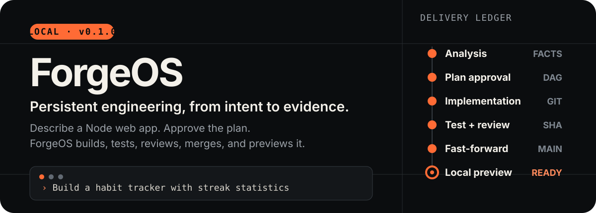
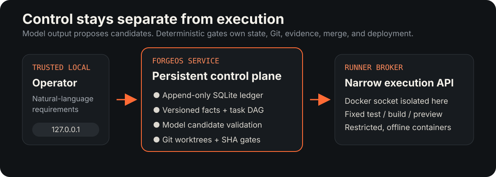

<p align="right"><strong>English</strong> · <a href="./README.zh-CN.md">简体中文</a></p>

<p align="center">
  
</p>

ForgeOS is a local, single-user prototype of a **persistent software-engineering organization**. You describe a Node web application in natural language, approve the proposed plan, and watch an auditable delivery graph move from requirements to a validated local preview.

It is designed around a simple rule: **models may propose; deterministic code decides**.

## See the whole loop

```text
You: Build a habit tracker with current and longest streak statistics.

ForgeOS: requirements → plan approval → isolated implementation
         → test evidence → independent review → fast-forward merge → preview
```

During that loop, ForgeOS keeps the engineering state visible instead of hiding it behind a chat transcript:

- **Versioned requirements** — facts and decisions are persisted in an append-only SQLite event ledger.
- **A live delivery DAG** — analysis, planning, implementation, test, review, merge, and deploy are explicit task nodes.
- **Isolated changes** — implementation happens in Git worktrees; task containers receive only one writable worktree.
- **Commit-bound evidence** — test and review results are valid only for the exact candidate SHA they examined.
- **Selective reconciliation** — revising a fact invalidates its consumers and descendants without discarding unrelated work.
- **Recoverable execution** — events, projections, changesets, evidence, model usage, and deployments survive restarts.

## How it is built

<p align="center">
  
</p>

| Boundary | Responsibility |
| --- | --- |
| **ForgeOS service** | HTTP UI, SSE updates, event ledger, projections, orchestration, model gateway, Git repositories, and worktrees |
| **Runner broker** | A bearer-authenticated internal API for fixed test, build, and preview operations; the only service with the Docker socket |
| **Task containers** | Non-root, offline, read-only root filesystem, dropped capabilities, resource limits, and one writable worktree |

The delivery pipeline is:

```text
analysis → planning → implementation → test → review → merge → deploy
```

Failed evidence creates repair work rather than erasing history. Merge requires a clean fast-forward from the frozen base plus passing evidence bound to the candidate commit.

## Quick start

### Prerequisites

- Docker Desktop using the WSL 2 Linux engine
- A [SiliconFlow](https://siliconflow.cn/) API key

### 1. Prepare local secrets

Create these ignored files:

```text
.secrets/siliconflow_api_key   # your API key
.secrets/runner_broker_token   # a random value with at least 32 characters
```

### 2. Configure the workspace path

Copy `.env.example` to `.env`, then set `FORGEOS_HOST_WORKSPACE_ROOT` to the absolute path of this repository's `.forgeos/workspaces` directory:

```dotenv
FORGEOS_HOST_WORKSPACE_ROOT=D:/absolute/path/to/ForgeOS/.forgeos/workspaces
SILICONFLOW_SECRET_FILE=./.secrets/siliconflow_api_key
BROKER_TOKEN_FILE=./.secrets/runner_broker_token
```

### 3. Start ForgeOS

```bash
docker compose up --build -d
```

Open [http://127.0.0.1:3000](http://127.0.0.1:3000), describe a project, review the generated plan, and approve it in natural language.

> [!IMPORTANT]
> State lives in the `forgeos-state` Docker volume and `.forgeos/workspaces`. `docker compose down` preserves it. Use `docker compose down -v` only when you deliberately want to delete the event database and project history.

## What you can inspect

The browser UI exposes the information needed to understand a run:

- conversation and open questions;
- the current task DAG and node states;
- the immutable event timeline;
- test and review evidence;
- model token usage and estimated cost;
- the commit and URL of a healthy local preview.

The read API also provides health, project lists, complete snapshots, event history, and server-sent event streams. User mutations remain intentionally narrow: create a project or send a natural-language project message.

## Development

ForgeOS uses Node.js 24, TypeScript, Fastify, SQLite, Zod, Vitest, Docker, and Git worktrees.

```bash
npm install
npm run check       # TypeScript validation
npm test            # deterministic tests; no model calls
npm run build       # compile and copy static assets
```

For a development server outside Compose:

```bash
npm run dev
npm run dev:broker
```

The release validation record includes **45 passing tests**, successful type-check and production build, Compose health, persistence across restart, selective fact invalidation, browser acceptance, and a complete live delivery loop. See [`docs/validation.md`](./docs/validation.md) for the recorded evidence.

## Security boundaries

ForgeOS v0.1.0 assumes **one trusted local operator**. It does not claim hostile multi-tenant isolation.

- The UI binds to `127.0.0.1`; there are no accounts or public ingress.
- The model key is mounted as a Compose secret and is excluded from Git, images, events, logs, and task containers.
- The ForgeOS service never receives the Docker socket.
- Candidate paths reject absolute paths, traversal, and symlink escape; protected build files cannot be changed by model output.
- The runner broker is security-critical: because it owns the Docker socket, compromising it implies Docker-host control. Do not expose it or ForgeOS beyond the local machine.

Read the complete assumptions and controls in [`docs/threat-model.md`](./docs/threat-model.md).

## Current scope

This release targets small, zero-dependency Node web applications built from ForgeOS's fixed template. It is a working end-to-end prototype, not a general-purpose coding platform, remote service, or multi-user production system.

## Documentation

- [`docs/architecture.md`](./docs/architecture.md) — state model, delivery graph, and service responsibilities
- [`docs/operations.md`](./docs/operations.md) — recovery, backup, validation, and secret rotation
- [`docs/validation.md`](./docs/validation.md) — v0.1.0 verification record
- [`docs/threat-model.md`](./docs/threat-model.md) — trust assumptions and security boundaries

## License

ForgeOS is licensed under the [Apache License 2.0](./LICENSE).
