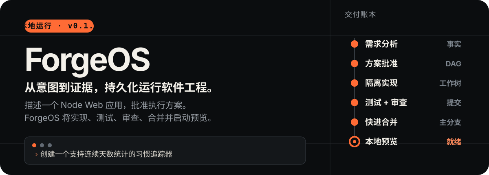
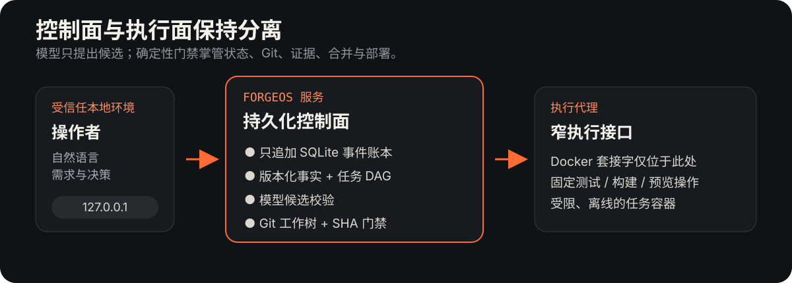

<p align="right"><a href="./README.md">English</a> · <strong>简体中文</strong></p>

<p align="center">
  
</p>

ForgeOS 是一个在本地运行、面向单用户的**持久化软件工程组织原型**。你用自然语言描述一个 Node Web 应用，批准生成的方案，然后通过可审计的交付图观察需求如何变成经过验证的本地预览。

它围绕一条简单规则设计：**模型可以提出候选，确定性代码负责决策。**

## 一次完整交付

```text
你：创建一个习惯追踪器，显示当前连续天数和最长连续天数。

ForgeOS：需求 → 方案批准 → 隔离实现 → 测试证据
         → 独立审查 → 快进合并 → 本地预览
```

在整个过程中，ForgeOS 会公开工程状态，而不是把一切藏在聊天记录后面：

- **版本化需求** — 事实与决策持久化到只追加的 SQLite 事件账本中。
- **实时交付 DAG** — 分析、规划、实现、测试、审查、合并和部署都是明确的任务节点。
- **隔离变更** — 实现在 Git 工作树中进行；任务容器只能写入一个工作树。
- **绑定提交的证据** — 测试与审查结果只对其实际检查的候选 SHA 有效。
- **选择性协调** — 修改事实时，只让其消费者和后代任务失效，不丢弃无关工作。
- **可恢复执行** — 事件、投影、变更集、证据、模型用量和部署状态均可跨重启保留。

## 系统如何组成

<p align="center">
  
</p>

| 边界 | 职责 |
| --- | --- |
| **ForgeOS 服务** | HTTP 界面、SSE 更新、事件账本、投影、编排、模型网关、Git 仓库与工作树 |
| **执行代理** | 仅提供固定测试、构建和预览操作的内部 Bearer 认证 API；它是唯一持有 Docker 套接字的服务 |
| **任务容器** | 非 root、无网络、只读根文件系统、移除 capabilities、限制资源，且只有一个可写工作树 |

交付流水线如下：

```text
分析 → 规划 → 实现 → 测试 → 审查 → 合并 → 部署
```

验证失败会生成修复任务，而不会抹去失败历史。只有候选提交具备与其 SHA 精确绑定的通过证据，且可从冻结基线干净地快进，系统才允许合并。

## 快速开始

### 前置条件

- 使用 WSL 2 Linux 引擎的 Docker Desktop
- [SiliconFlow（硅基流动）](https://siliconflow.cn/) API 密钥

### 1. 准备本地密钥

创建以下已被 Git 忽略的文件：

```text
.secrets/siliconflow_api_key   # API 密钥
.secrets/runner_broker_token   # 至少 32 个字符的随机值
```

### 2. 配置工作区路径

将 `.env.example` 复制为 `.env`，再把 `FORGEOS_HOST_WORKSPACE_ROOT` 设为本仓库 `.forgeos/workspaces` 目录的绝对路径：

```dotenv
FORGEOS_HOST_WORKSPACE_ROOT=D:/absolute/path/to/ForgeOS/.forgeos/workspaces
SILICONFLOW_SECRET_FILE=./.secrets/siliconflow_api_key
BROKER_TOKEN_FILE=./.secrets/runner_broker_token
```

### 3. 启动 ForgeOS

```bash
docker compose up --build -d
```

打开 [http://127.0.0.1:3000](http://127.0.0.1:3000)，描述一个项目，检查生成的方案，然后用自然语言批准方案。

> [!IMPORTANT]
> 状态保存在 `forgeos-state` Docker 卷和 `.forgeos/workspaces` 中。`docker compose down` 会保留状态；只有在确实要删除事件数据库和全部项目历史时，才使用 `docker compose down -v`。

## 可以检查什么

浏览器界面会展示理解一次运行所需的信息：

- 对话和待回答问题；
- 当前任务 DAG 及节点状态；
- 不可变事件时间线；
- 测试与审查证据；
- 模型 Token 用量和预估成本；
- 健康本地预览对应的提交和 URL。

只读 API 还提供健康状态、项目列表、完整快照、事件历史和 SSE 事件流。用户侧写操作被刻意收窄：创建项目，或发送自然语言项目消息。

## 开发

ForgeOS 使用 Node.js 24、TypeScript、Fastify、SQLite、Zod、Vitest、Docker 和 Git 工作树。

```bash
npm install
npm run check       # TypeScript 校验
npm test            # 确定性测试，不调用模型
npm run build       # 编译并复制静态资源
```

在 Compose 之外启动开发服务器：

```bash
npm run dev
npm run dev:broker
```

发布验证记录包括 **45 项测试通过**、类型检查和生产构建成功、Compose 健康检查、重启后状态持久化、选择性事实失效、浏览器验收以及一次完整的真实交付闭环。记录证据见 [`docs/validation.md`](./docs/validation.md)。

## 安全边界

ForgeOS v0.1.0 假设只有**一名受信任的本地操作者**，不声称能够抵御敌对的多租户环境。

- UI 只绑定 `127.0.0.1`，没有账户系统或公网入口。
- 模型密钥以 Compose secret 挂载，不进入 Git、镜像、事件、日志或任务容器。
- ForgeOS 服务不会接触 Docker 套接字。
- 候选路径会拒绝绝对路径、目录穿越和符号链接逃逸；模型输出不能修改受保护的构建文件。
- 执行代理是安全关键组件：它持有 Docker 套接字，因此攻陷它意味着获得 Docker 主机控制权。不要把执行代理或 ForgeOS 暴露到本机之外。

完整假设与控制措施见 [`docs/threat-model.md`](./docs/threat-model.md)。

## 当前范围

本版本面向基于 ForgeOS 固定模板构建的小型、零依赖 Node Web 应用。它是可运行的端到端原型，不是通用编码平台、远程服务或多用户生产系统。

## 文档

- [`docs/architecture.md`](./docs/architecture.md) — 状态模型、交付图与服务职责
- [`docs/operations.md`](./docs/operations.md) — 恢复、备份、验证与密钥轮换
- [`docs/validation.md`](./docs/validation.md) — v0.1.0 验证记录
- [`docs/threat-model.md`](./docs/threat-model.md) — 信任假设与安全边界

## 许可证

ForgeOS 采用 [Apache License 2.0](./LICENSE) 许可。
